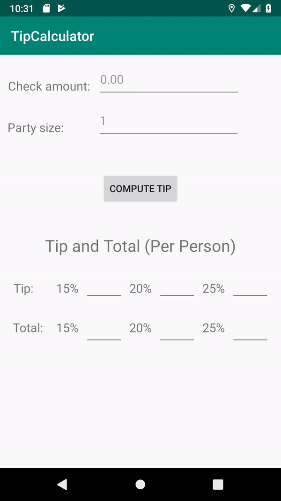

# Tip Calculator
An Android application that calculates the tip and total amount each person should pay.

## How to Use
* User enters as input the amount of the check and the number of people splitting the check (only digits and decimals are permitted)
* The user then presses on the "Compute Tip" button
* The app produces as output both the amount of the tip and total amount each person should pay for a 15%, 20%, and 25% tip. 
* The given output evenly splits the check among the given number of party members. Calculated tip and total per person is rounded to the nearest integer.
* If any errors exist in the given input, such as empty or invalid (e.g. negative) values, a Toast pops up notifying the user that the input is invalid.
* The user can select and copy the calculated values.

## App Walkthough
 